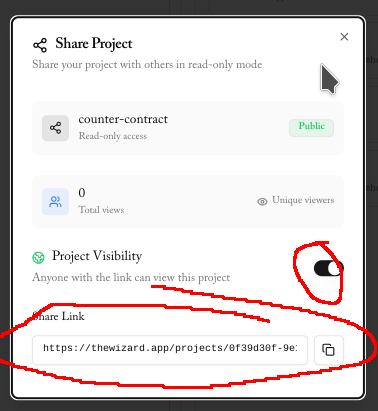

# ETH Bucharest reference contract

This is the example contract to fork and develop on top of for the ETH Bucharest Stylus
Gas Redux challenge.

The goal of the hackathon is to find cheaper solutions when the "prove" function is
called, returning output that can be verified by the reference prover
[here](https://github.com/af-afk/ethbucharest.bayge.xyz/blob/trunk/src/prover.rs).

You can read more about ETH Bucharest hashing
[here](https://stylus-saturdays.com/i/159344476/introducing-bucharest-pow).

## Submitting your contract

To register your contract in the competition, you must have deployed your contract, have
the testnet address that you used to register with the [ETH Bucharest
faucet](https://faucet.ethbucharest.superposition.so), and have the **publicly accessible**
Github repository or [The Wizard on Stylus shared link](https://thewizard.app/) included
in the call on-chain.

This ensures that a moderator doesn't remove you for not sharing your repo in your
submission!

This is the config in the settings option to get the link:

You can either use (the Superposition submitter
form)[https://ethbucharest.superposition.so], `register.sh`:

	export SPN_SUPERPOSITION_KEY=<your private key>
	./register.sh <your contract address> <your testnet deployer address> <your code link>

Or cast:

	cast send --private-key <your private key here> 0x0000000000000000000000000000000000000000 'register(address,address,string)' <your contract address here after using deploy.sh> <your testnet address> <your repository address>

This will notify the backend worker to profile your deployed contract, and then replace
the leader, if you're in the lead.

## Getting started

### Dependencies

| Description            | Link                                                               |
|------------------------|--------------------------------------------------------------------|
| Standard foundry suite | [link](https://book.getfoundry.sh/getting-started/installation)    |
| Rust                   | [link](https://rustup.rs/)                                         |

Make is not needed, but it can be useful as a frontend to `build.sh`, which invokes Cargo
this way:

	cargo build \
		--release \
		--target wasm32-unknown-unknown

### Building

	./build.sh

### Estimating performance

### Testing

Simple testing is possible using `proptest` to call the default-provided `solve` function,
then to call it again with the same outputs.

To compare your custom algorithm against the online contract, you can simply run the test
suite. The source code is documented for accessible testing.

## Hard requirements for solutions

Be careful! If you don't follow these goals, the remote contract won't be able to verify
your solution.

1. The online prover must reproduce the same lower and upper values when called

2. Siphash must be used for the hashing function
